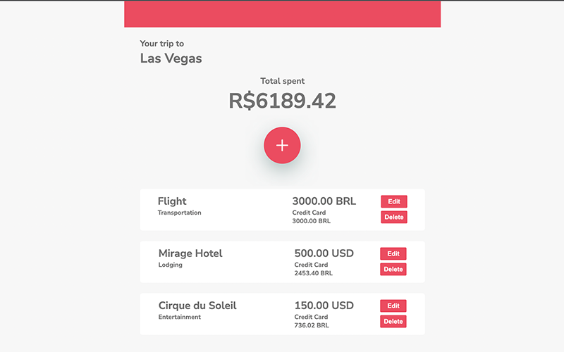

# Travel Wallet
React project with CRUD functions using RTL, Jest, Redux and React Router.
 
 
An mobile wallet to control your travel expenses in multiple currencies using real time exchange rates.
 
 
<a href="https://fkrein1.github.io/travel-wallet">Travel Wallet GitHub Page</a>
 
 

